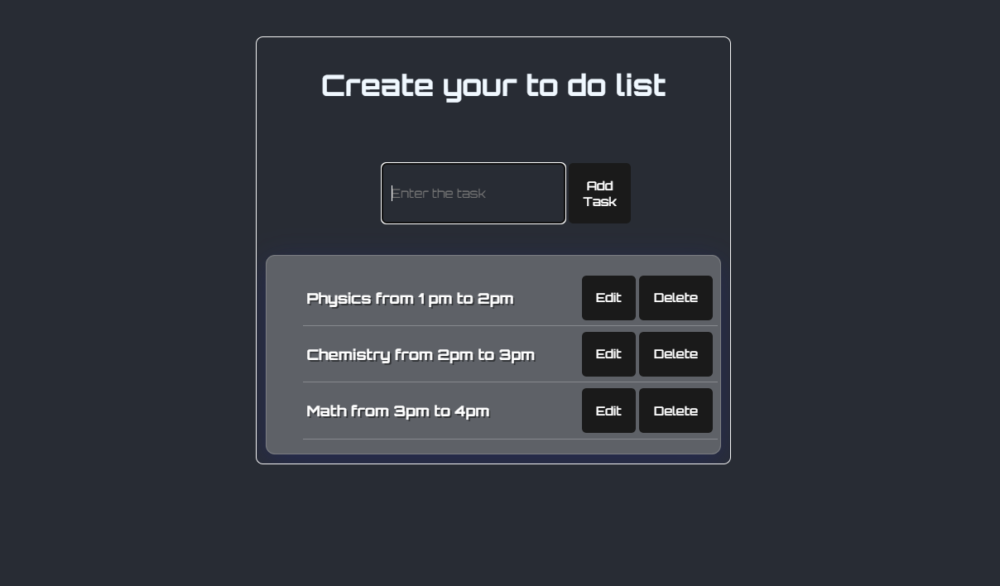

## To-Do List App

This is a simple to-do list application built with React. It allows you to create, update, and delete tasks.
### Features

* Add new tasks with titles.
* Update existing tasks by editing their titles.
* Delete tasks from the list.

## Usage

1. Enter the desired task title in the input field.
2. Click the "Add Task" button to create a new task.
3. Click on the "Edit" button for an existing task to edit its title.
4. Click on the "Update" button to save the changes made to the task title.
5. Click on the "Delete" button for an existing task to remove it from the list.
### Technologies Used

* React
* JavaScript (JSX)
### Contributing

Feel free to fork this repository and contribute by adding new features or fixing bugs. Please create a pull request with your changes.
